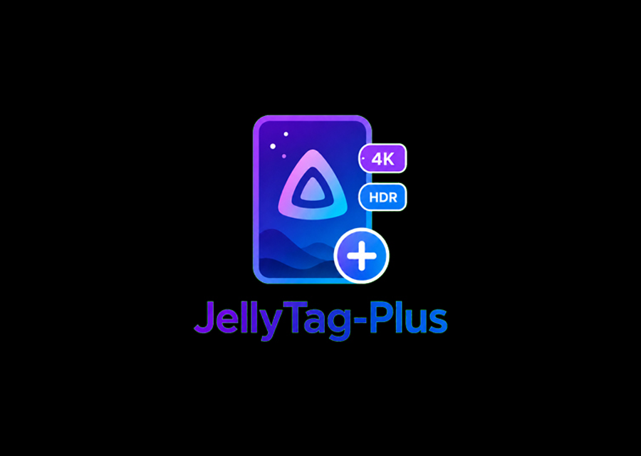

# JellyTag-Plus

<p>
  <a href="https://ko-fi.com/yeahnoforsure_"></a>
</p>

JellyTag-Plus overlays quality, language, and collection badges on Jellyfin posters and thumbnails. It is a fork/continuation of JellyTag from [Atilil/jellyfin-plugins](https://github.com/Atilil/jellyfin-plugins), renamed so it can live separately from the original plugin.

> **Disclaimer:** The original plugins in [Atilil/jellyfin-plugins](https://github.com/Atilil/jellyfin-plugins) are described by their author as built from vibecoding; see [Atilil/jellyfin-plugins#17](https://github.com/Atilil/jellyfin-plugins/issues/17). The additional and modified features in JellyTag-Plus are also vibecoded.

<p align="center">
    
</p>

## What Is Different From JellyTag

JellyTag-Plus keeps the original server-side badge overlay idea and adds a lot of practical library-management behavior:

- **Collection badges**: Add one or more collection rules. If an item belongs to a Jellyfin collection whose title matches your regex, it can receive that collection's badge.
- **Custom collection images**: Each collection badge rule can use its own uploaded image.
- **Collection targeting**: Collection badges can be enabled separately for posters, season posters, series thumbnails, and episode thumbnails.
- **Per-library badge controls**: Choose which badge categories each library gets: resolution, HDR, codec, audio, language, and collections.
- **Expanded language flags**: Added and adjusted language flag assets, including `tgl` and `fil` mapping to `flag-fil.svg`.
- **Undetermined language fallback**: Missing, unknown, or undetermined languages use `flag-und.svg` instead of falling back to text.
- **Alphabetized language badges**: Language badges are rendered in stable alphabetical order.
- **Series language aggregation**: Series-level language badges can reflect languages found across episodes.
- **Force image refresh**: Optional refresh flow intended to help clients notice that artwork has changed.
- **Aggressive cache warmer**: Scheduled task that pre-renders common image request variants used by major Jellyfin clients.

## Features

- Resolution, HDR, video codec, audio, language flag, VOST, and collection badges
- Server-side rendering through Jellyfin image middleware
- Poster and thumbnail support
- Per-panel controls for position, order, layout, size, margin, gap, style, and text colors
- SVG/image badge mode and text badge mode
- Custom badge uploads
- Multiple collection rules with regex matching and custom images
- Per-library badge category filtering
- Config export/import
- File-based image cache with configurable cache duration
- Scheduled cache cleanup task
- Scheduled cache warmer task

## Bypass Overlays

Image requests can include `?jellytag=off` to return the original Jellyfin image without JellyTag-Plus overlays. This per-request bypass is intended for export and archive tools such as [Pixelfin](https://github.com/nothing2obvi/pixelfin).

Example:

```text
/Items/{itemId}/Images/Primary?jellytag=off
```

## Cache Warmer

The **JellyTag-Plus Cache Warmer** is a scheduled task that walks enabled libraries and requests poster/thumbnail image URLs ahead of time. Those requests pass through JellyTag-Plus exactly like real client requests, causing badged images to be rendered and stored in the plugin cache before users browse to them.

The warmer includes organized client profiles for:

- Findroid
- Android TV
- Roku
- Streamyfin
- Wholphin

It warms only documented `Primary` and `Thumb` variants for those clients. Jellyfin Web and WebShellClients, meaning Android, iOS, and Desktop Qt when they show Jellyfin Web inside the native app shell, are intentionally not warmed because they calculate image sizes dynamically.

Client profiles can be enabled, disabled, and reordered from the configuration page. The warmer runs in phases across all enabled clients: Home, then Libraries, then Episodes, then Other. Within each phase it follows the configured client profile order.

Warmup progress is stored after successful requests so interval-based runs start with variants that have not been warmed yet. Clearing the JellyTag-Plus image cache also clears that warmer progress.

Warmer throttling is configurable:

| Option | Description | Default |
|--------|-------------|---------|
| Warmer Max Concurrency | Maximum number of warmer image requests allowed to run at the same time | 1 |
| Warmer Delay | Delay after each warmer request, in milliseconds | 250 |
| Warmer Client Quiet Window | How long the warmer waits after normal client image traffic before starting another request, in seconds | 15 |
| Warmer Client Profiles | Enabled client profiles and their warmup order | Android TV, Roku, Streamyfin, Wholphin, Findroid |

Normal client image requests take priority. When someone is browsing posters or thumbnails, the warmer pauses until the quiet window passes, then continues with not-yet-warmed variants.

The configuration page shows **Estimated Warmer Progress** for each client profile, with phase percentages underneath. This is based on variants completed by the cache warmer. Images rendered only by normal client browsing may be counted after the warmer touches them.

> **Important:** The warmer is **very aggressive**. It can create many cached images per media item, especially when posters and thumbnails are both enabled. This can make clients faster after warming, but plugin cache storage may become quite large. Use it deliberately and keep an eye on disk usage.

## Force Image Refresh

Force Image Refresh is an optional helper for stubborn client-side image caches. It attempts to make Jellyfin clients notice changed artwork by briefly swapping/restoring item images and then requesting the restored image. This is meant to help devices such as Android TV or Roku fetch fresh artwork when badges change.

This feature is intentionally more invasive than normal rendering. Keep image backups and use it carefully.

## Installation

1. In Jellyfin, go to **Dashboard -> Plugins -> Repositories**
2. Add this repository URL:
   ```text
   https://raw.githubusercontent.com/nothing2obvi/jellyfin-plugins/main/manifest.json
   ```
3. Go to **Catalog**, find **JellyTag-Plus**, and install it
4. Restart Jellyfin

## Configuration

Go to **Dashboard -> Plugins -> JellyTag-Plus** to access the configuration page.

### Global Settings

| Option | Description | Default |
|--------|-------------|---------|
| Enable JellyTag-Plus | Enable or disable the plugin globally | Enabled |
| Output Format | JPEG or WebP | JPEG |
| JPEG Quality | Output image quality | 90 |
| Cache Duration | How long cached images are kept, in hours. `0` means forever. | 168 |
| Warmer Max Concurrency | Maximum simultaneous warmer image requests | 1 |
| Warmer Delay | Delay after each warmer request, in milliseconds | 250 |
| Warmer Client Quiet Window | Seconds of no normal image traffic before the warmer resumes | 15 |
| Warmer Client Profiles | Enabled client profiles and their warmup order | Android TV, Roku, Streamyfin, Wholphin, Findroid |
| Force Image Refresh | Attempt to make clients notice changed artwork | Disabled |
| Excluded Libraries | Libraries to skip for badge generation | None |

### Poster And Thumbnail Settings

Each image type has independent panel settings. Thumbnails can optionally mirror poster settings with a size reduction.

Each badge category is configured as a panel with:

| Setting | Description |
|---------|-------------|
| Enabled | Show or hide this category |
| Position | Corner, border-center, or edge placement |
| Layout | Horizontal or vertical stacking |
| Style | Image or text badges |
| Size % | Badge width as percentage of image |
| Margin % | Distance from edge |
| Gap % | Spacing between badges |
| Display Mode | Show highest quality only, or all |
| Order | Panel stacking order |
| Text colors | Background color, text color, opacity, corner radius |

## Collection Badges

Collection rules are configured by regex. A rule matches the **Jellyfin collection title**, not a TMDB collection id. Custom collections are supported.

Each collection rule can have:

- Badge key
- Collection regex
- Text label
- Uploaded custom image
- Poster toggle
- Season poster toggle
- Series thumbnail toggle
- Episode thumbnail toggle

## Custom Badges

You can replace default badges with your own image assets or customize text labels for text-style badges. Custom assets are stored in the Jellyfin plugin data folder and survive updates.

## How It Works

JellyTag-Plus intercepts Jellyfin image requests for supported image types, detects applicable badges from item metadata and collection membership, filters them through your configuration, renders the badges onto the requested image size, and caches the result. Future requests for the same image variant can be served from the plugin cache.

## Requirements

- Jellyfin 10.11.x or later
- .NET 9.0 runtime, included with Jellyfin 10.11+

## Troubleshooting

- **Badges not appearing:** Verify the plugin is enabled, the item library is enabled, and the badge category is enabled for that library.
- **Old images still showing on clients:** Clear the client image cache, use Force Image Refresh carefully, or run the cache warmer after clearing the JellyTag-Plus image cache.
- **Cache getting large:** Lower cache duration, clear the plugin image cache, disable unneeded badge categories, or run the warmer less often.
- **Slow first warmer run:** Expected. The first run may render many image variants. Later runs should be faster when cached variants are still valid.

## License

MIT License
