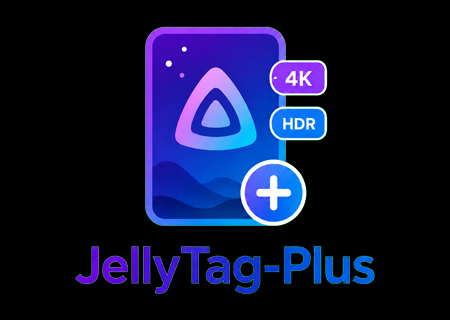

# nothing2obvi Jellyfin Plugins

A collection of plugins for Jellyfin media server.

## Installation

1. Open Jellyfin and go to **Administration → Dashboard → Plugins → Repositories**
2. Click **Add** and enter:
   - **Name:** `nothing2obvi Plugins`
   - **URL:** `https://raw.githubusercontent.com/nothing2obvi/jellyfin-plugins/main/manifest.json`
3. Click **Save**
4. Go to **Catalog** tab and install the plugins you want
5. Restart Jellyfin

## Available Plugins

### WatchSync

    

Automatically synchronizes watch history between libraries of different qualities (4K/HD). When a movie is watched in 4K, the HD version is also marked as watched (and vice versa).

**Features:**
- Automatic sync on playback stop
- Smart matching via IMDB, TMDB, TVDB
- Support for movies and TV series
- Configurable completion threshold
- Library and user exclusion
- Full sync scheduled task

[More details](WatchSync/README.md)

---

### JellyTag-Plus

    

Automatically overlays quality badges on your media posters and thumbnails. Supports resolution, HDR, video codec, audio, language flags, and VOST indicator. Badges are applied server-side via HTTP middleware and are visible on all Jellyfin clients.

**Features:**
- Automatic resolution, HDR, codec, audio, and language detection from video metadata
- Configurable badge position, size, margin, color, and style per image type
- Support for posters and thumbnails
- SVG language flags, including mappings for `tgl` and `fil` to `flag-fil.svg`
- File-based image caching for performance
- Works on all clients (web, mobile, TV, Kodi)

[More details](Jellytag/README.md)

---

### Requirements

- Jellyfin 10.11.0 or higher
- .NET 9 SDK (for building)

## License

MIT License - see [LICENSE](LICENSE) file.

## Author

**nothing2obvi**

---

## Disclaimer

This project includes code derived from the original Jellyfin plugin repository and local modifications for JellyTag-Plus.
