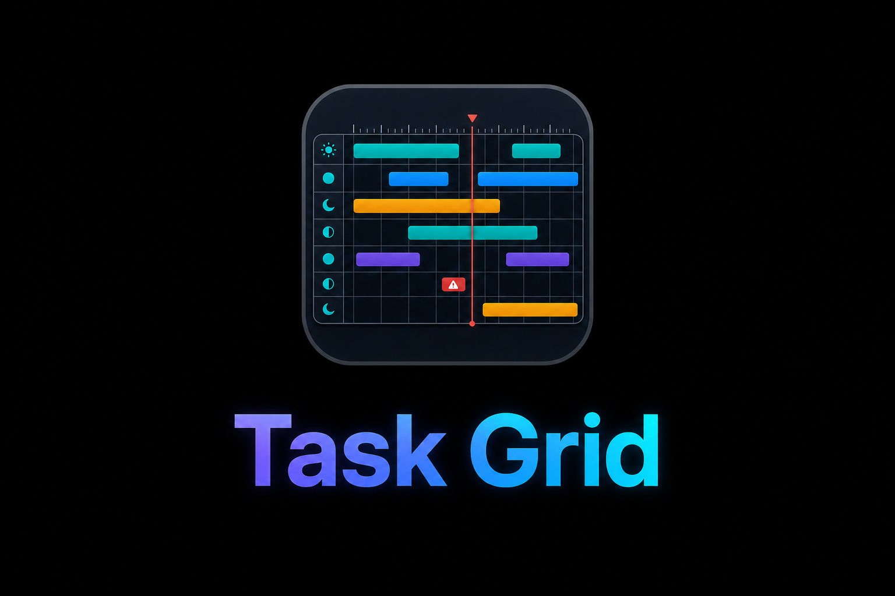

# Task Grid

<p>
  <a href="https://ko-fi.com/yeahnoforsure_" target="_blank" rel="noopener noreferrer"></a>
</p>

Task Grid is a Jellyfin plugin that shows scheduled tasks on a Monday-first weekly grid, with days as rows and hours as columns.

<p align="center">
    
</p>

> **Fork status:** Task Grid is not a fork of [Atilil/jellyfin-plugins](https://github.com/Atilil/jellyfin-plugins). It is a new plugin added in this repository.

## Features

- Monday-through-Sunday task grid, with Monday on top
- 24 hour columns for each day
- Task blocks default to maximum runtime when Jellyfin exposes one
- Visual Length can be adjusted by dragging a block edge, saved per task, and snapped to 15-minute increments
- Visual Length cannot be shorter than 15 minutes or the last successful runtime
- Dotted in-block marker for the last successful runtime when the latest run was not aborted or errored
- Red warning treatment when the most recent task result says it was aborted by shutdown
- Refresh button for recently changed schedules
- Saved grid zoom control up to 1000% that widens the hour columns and enables horizontal scrolling
- Per-task color coding
- Immediate grid preview for color, heavy, and conflict-ignore changes
- Recently used color swatches in a compact dropdown beside the hex color field and selector
- Optional red conflict highlighting, with per-task conflict ignore
- Optional aborted/error result highlighting
- Custom sidebar access from Jellyfin's Extensions section
- Native Jellyfin task scheduler links integrated into each task row
- Task blocks pack into rows only when their time windows do not overlap
- Repeated same-task start times merge into one retry-window block with white start markers
- Trigger summaries in the task list
- Optional display of tasks without daily or weekly grid triggers in the task list

## Notes

Task Grid reads Jellyfin's scheduled task data through the same scheduled task API used by the admin dashboard. It does not change task schedules. Display preferences such as colors and conflict options are stored in the plugin configuration.

Jellyfin does not always know how long a future task will run. Task Grid uses the last completed runtime rounded to the nearest 15 minutes when available. If a task has been running long and has a maximum runtime, Task Grid shows the full time-limit window. If no runtime history or limit is available, it falls back to a 30 minute display estimate.

## Installation

1. Open Jellyfin and go to **Administration -> Dashboard -> Plugins -> Repositories**
2. Click **Add** and enter:
   - **Name:** `nothing2obvi Plugins`
   - **URL:** `https://raw.githubusercontent.com/nothing2obvi/jellyfin-plugins/main/manifest.json`
3. Click **Save**
4. Go to **Catalog** and install **Task Grid**
5. Restart Jellyfin

Task Grid is available from the same plugin repository manifest as the other plugins in this repo.

## Building from Source

```bash
cd TaskGrid
./build.sh
```

By default, this builds both supported targets:

- Jellyfin 10.11: `task-grid-1.1.12.0.zip`
- Jellyfin v12-rc2: `task-grid-1.2.12.0-jellyfin12-rc2.zip`
- Jellyfin v12-rc3: `task-grid-1.3.12.0-jellyfin12-rc3.zip`

To build only one target:

```bash
./build.sh 10.11
./build.sh 12-rc2
./build.sh 12-rc3
```

The Jellyfin v12-rc2 build defaults to Jellyfin package references using `12.0.0-rc2`. The Jellyfin v12-rc3 build defaults to Jellyfin package references using `12.0.0-rc3`. To test rc3 against a local Jellyfin source tree, set `JELLYFIN_SOURCE_ROOT=/Users/joncasas/GitHub/jellyfin`.

Or manually:

```bash
cd TaskGrid/Jellyfin.Plugin.TaskGrid
dotnet build -c Release -f net9.0 /p:JellyfinTargetAbi=10.11.0.0
dotnet build -c Release -f net10.0 /p:JellyfinTargetAbi=12.0.0.0 /p:JellyfinSourceRoot=/Users/joncasas/GitHub/jellyfin
```

The DLL will be generated under the matching `bin/Release/` target framework folder.

## Architecture

```text
Jellyfin.Plugin.TaskGrid/
├── Plugin.cs
├── Configuration/
│   ├── PluginConfiguration.cs
│   └── configPage.html
└── Jellyfin.Plugin.TaskGrid.csproj
```

---

*This plugin was developed with the assistance of AI.*
